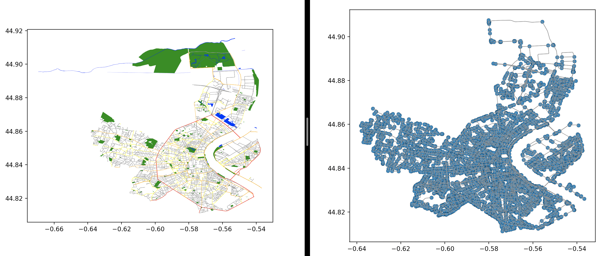

# Network Builder

## Features

This package is using different project in order to download spatial geometries, visualize and analyse them :

  * [OSMnx](https://github.com/gboeing/osmnx): Python package that lets you download spatial geometries and model, project, visualize, and analyze real-world street networks from OpenStreetMap's APIs.
  * [Herepy](https://github.com/abdullahselek/HerePy): Python interface for the [HERE API](https://developer.here.com).
  * [Scipy](https://github.com/scipy/scipy): Open-source software for mathematics, science, and engineering.
  * [Matplotlib](https://github.com/matplotlib/matplotlib): Comprehensive library for creating static, animated, and interactive visualizations in Python.


## How to use OSMnx

### main_osmnx

The first step consist in downloading street data from cities and create the associated graphs using the Osmnx package.
As the result, users can obtain json file containing all street data that can be useful (id, osmid, type ...).
The json file (file_command.csv) can be updated at the end using a file containing all command from cities.
The file containing all command must be, at least, like this : ID, lon, lat, ...
Then, we use the following function [get_nearest_edges()](https://osmnx.readthedocs.io/en/stable/osmnx.html) to project commands on streets.
The scipy package is used in order to create a KD-Tree. this allows to update the json rapidly, even if users is dealing with billions of commands.

Users can also obtain a visualized graph from the city chose :




For a quick overview of OSMnx, see this [demo notebook](https://github.com/gboeing/osmnx-examples/blob/master/notebooks/00-osmnx-features-demo.ipynb).


### Introduction

Import OSMnx, download and model Manhattan's drivable street network in just one line of code, then visualize it in one more:

```python
import osmnx as ox
G = ox.graph_from_place('Manhattan, New York, USA', network_type='drive')
fig, ax = ox.plot_graph(G)
```


In a couple more lines of code you can examine intersection density, network circuity, average block size, PageRank, betweenness centrality, connectivity, spatial distribution of dead-ends or 4-way intersections, etc for anywhere in the world:

```python
basic_stats = ox.basic_stats(G)
print(basic_stats['circuity_avg'])

extended_stats = ox.extended_stats(G)
print(extended_stats['pagerank_max_node'])
```

You can just as easily download and work with [amenities/points of interest](https://osmnx.readthedocs.io/en/stable/osmnx.html#osmnx.pois.pois_from_place), [building footprints](https://github.com/gboeing/osmnx-examples/blob/master/notebooks/10-building-footprints.ipynb), and [node elevation/street grade](https://github.com/gboeing/osmnx-examples/blob/master/notebooks/12-node-elevations-edge-grades.ipynb) data.


### Download and model street networks

OSMnx lets you download street network data and build topologically corrected multidigraphs, project to UTM and plot the networks, and save the street network as SVGs, GraphML files, .osm files, shapefiles, or geopackages for later use. The street networks are directed and preserve one-way directionality. API responses can be cached locally so OSMnx doesn't have to request the same data from the API multiple times - saving bandwidth, increasing speed, and enabling reproducibility.

You can download a street network by providing OSMnx any of the following (demonstrated in the examples):
  - a bounding box
  - a lat-long point plus a distance (either distance along the network, or cardinal)
  - an address plus a distance (either distance along the network, or cardinal)
  - a place name or list of place names (for OSMnx to automatically geocode and get the boundary of)
  - a polygon of the desired street network's boundaries

You can also specify several different built-in network types:
  - `drive` - get drivable public streets (but not service roads)
  - `drive_service` - get drivable streets, including service roads
  - `walk` - get all streets and paths that pedestrians can use (this network type ignores one-way directionality)
  - `bike` - get all streets and paths that cyclists can use
  - `all` - download all non-private OSM streets and paths
  - `all_private` - download all OSM streets and paths, including private-access ones

Or you can define your own fine-tuned network type using OSMnx's `custom_filter` parameter (to get just highways, or railways, canals, etc). For an in-depth demonstration of creating street networks, see [this notebook](https://github.com/gboeing/osmnx-examples/blob/master/notebooks/03-graph-place-queries.ipynb).


### Analyze and visualize street networks

OSMnx allows you to calculate origin-destination routes along the network and quickly visualize them. You can easily visualize elevation, street grade, one-way streets, culs-de-sac, high/low connectivity intersections, building footprints, etc. OSMnx provides built-in capabilities to quickly calculate spatial network metrics like intersection density, average intersection degree, edge density, average street segment length, clustering coefficients, betweenness centrality, etc. For better spatial analysis and visualization, OSMnx lets you project your graph either to a CRS of your choice or automatically to UTM for easy meter-based analysis and projected visualization.

You can also calculate shortest paths with different impedances for network routing and trip simulation, calculate street bearings to analyze network orientation, or snap your own data to the network using OSMnx's fast get nearest node and get nearest edge functions.

For examples of analyzing street networks with OSMnx, see [this notebook](https://github.com/gboeing/osmnx-examples/blob/master/notebooks/06-stats-indicators-centrality.ipynb).


### Correct and simplify street network topology

Simplification is normally done by OSMnx automatically under the hood, but we can break it out to see how it works. OpenStreetMap nodes include intersections, but they also include all the points along a single block where the street curves. The latter are not nodes in the graph theory sense, so we remove them algorithmically and consolidate the set of edges between "true" network nodes into a single edge, but retain the actual spatial geometry. There are two simplification modes, strict and non-strict. The main difference is that unlike strict mode, non-strict mode allows simplification to an expansion graph.

For an in-depth demonstration of topological simplification with OSMnx, see [this notebook](https://github.com/gboeing/osmnx-examples/blob/master/notebooks/04-simplify-graph-consolidate-nodes.ipynb).


### Save street networks, building footprints, or points of interest to disk

OSMnx allows users to save street networks to disk as .osm files, as shapefiles or geopackages to work with in GIS software, as GraphML files to work with in Gephi or NetworkX, and as SVG files to work with in Illustrator. It also allows you to save place boundary geometries, building footprints, or amenities/points of interest to disk as shapefiles or geojson/geopackages via geopandas.

For examples of saving and loading networks to/from disk, see [this notebook](https://github.com/gboeing/osmnx-examples/blob/master/notebooks/05-save-load-networks.ipynb).


## More info

If you use OSMnx in your work, please cite the [journal article](https://geoffboeing.com/publications/osmnx-complex-street-networks/).

For complete documentation and code examples, see the [docs](https://osmnx.readthedocs.io/) and the [examples repo](https://github.com/gboeing/osmnx-examples).

For a more complete overview of [OSMnx, read this](https://geoffboeing.com/2016/11/osmnx-python-street-networks/).

Examples of projects and blog posts [using OSMnx](https://geoffboeing.com/2018/03/osmnx-features-roundup/)
