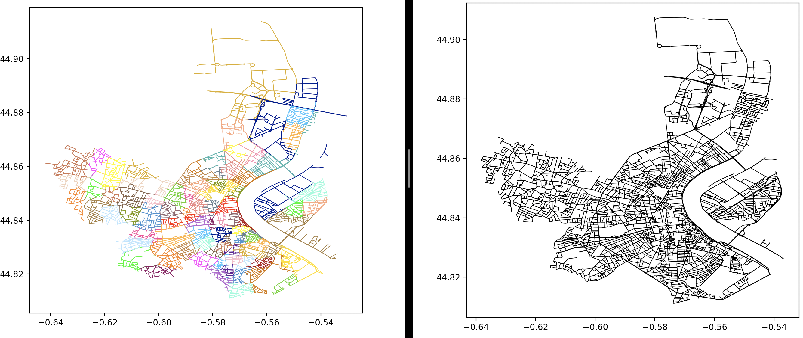

# Network Builder

## Features

This package is using different project in order to download spatial geometries, visualize and analyse them :

  * [OSMnx](https://github.com/gboeing/osmnx): Python package that lets you download spatial geometries and model, project, visualize, and analyze real-world street networks from OpenStreetMap's APIs.
  * [Herepy](https://github.com/abdullahselek/HerePy): Python interface for the [HERE API](https://developer.here.com).
  * [Scipy](https://github.com/scipy/scipy): Open-source software for mathematics, science, and engineering.
  * [Matplotlib](https://github.com/matplotlib/matplotlib): Comprehensive library for creating static, animated, and interactive visualizations in Python.

## How to use OSMnx

### main_osmnx

The first step consist in downloading street data from cities and create the associated graphs using the Osmnx package.
As the result, users can obtain json file containing all street data that can be useful (id, osmid, type ...).
The json file (file_command.csv) can be updated at the end using a file containing all command from cities.
The file containing all command must be, at least, like this : ID, lon, lat, ...
Then, we use the following function [get_nearest_edges()](https://osmnx.readthedocs.io/en/stable/osmnx.html) to project commands on streets.
The scipy package is used in order to create a KD-Tree. this allows to update the json rapidly, even if users is dealing with billions of commands.

Users can also obtain a visualized graph from the city chose :

On the left, we can see that roads are represented with different color :
  * red : primary road
  * orange : secondary road
  * yellow : tertiary road
  * grey : other

### cluster_IRIS

The second step consist in downloading iris data from a city and project the iris cluster associated with OSMnx.
As the result, users can obtain different json files:
  * cluster : file containing all street and their cluster.
  * point : file containing all point in each cluster.
  * matrix : file containing matrix for each cluster.

Matrices are obtain with here api (herepy) and represent the time travel from one point to an other with a car.
This api allows to have time matrices for a car, bicycle or truck.

Users will obtain the associated graphs from this city updated with Iris clustering :

Iris cluster are downloaded from the following [link](https://public.opendatasoft.com/explore/dataset/contours-iris/export/?flg=fr&q=&refine.nom_com=Bordeaux&dataChart=eyJxdWVyaWVzIjpbeyJjaGFydHMiOlt7InR5cGUiOiJjb2x1bW4iLCJmdW5jIjoiQ09VTlQiLCJzY2llbnRpZmljRGlzcGxheSI6dHJ1ZSwiY29sb3IiOiIjRkY1MTVBIn1dLCJ4QXhpcyI6Im5vbV9jb20iLCJtYXhwb2ludHMiOjUwLCJzb3J0IjoiIiwiY29uZmlnIjp7ImRhdGFzZXQiOiJjb250b3Vycy1pcmlzIiwib3B0aW9ucyI6eyJmbGciOiJmciIsInEiOiIiLCJyZWZpbmUubm9tX2NvbSI6IkJvcmRlYXV4In19fV0sInRpbWVzY2FsZSI6IiIsImRpc3BsYXlMZWdlbmQiOnRydWUsImFsaWduTW9udGgiOnRydWV9).
